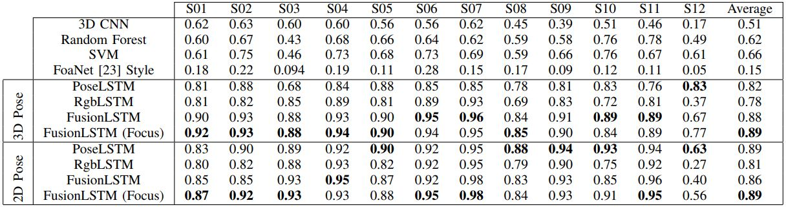

# Deep Hand Feature Based American Sign Language (ASL) Recognition.
Learning ASL video modeling using deep hand-patch features and pose (skeleton) based features <br>
Here is the diagram of the overall architecture, <br><br>

<br><br><br>

This repository contains source code for the following paper,

A. A. Hosain, P. Selvam Santhalingam, P. Pathak, J. Košecka and H. Rangwala, **"Body Pose and Deep Hand-shape Feature Based American Sign Language Recognition,"** 
2020 IEEE 7th International Conference on Data Science and Advanced Analytics (DSAA), 2020, pp. 207-215, doi: 10.1109/DSAA49011.2020.00033.


## Paper/Cite
```
@INPROCEEDINGS{9260043,
  author={Hosain, Al Amin and Selvam Santhalingam, Panneer and Pathak, Parth and Košecka, Jana and Rangwala, Huzefa},
  booktitle={2020 IEEE 7th International Conference on Data Science and Advanced Analytics (DSAA)}, 
  title={Body Pose and Deep Hand-shape Feature Based American Sign Language Recognition}, 
  year={2020},
  volume={},
  number={},
  pages={207-215},
  doi={10.1109/DSAA49011.2020.00033}}
```
## Data Download
* The network is trained on two types of input representation of an ASL video: the rgb hand feature and the pose data
* The data download link: [hand feature and pose download](https://drive.google.com/file/d/1xKUiVDSCheengsFRNR4fv9y_1i2OL8EH/view?usp=sharing)
  * The data directory ```deephand_embeddings``` contains 12 sub directories for 12 subjects in the ```GMU-ASL51``` dataset
  * Each subject directory titled as for example ```subject01_embd``` contains deep hand rgb hand patch features and openpose pose data of ```subject 1```
  * An example hand feature file is ```restaurant_subject01_4_rgb_embd.npy```
    *   This means hand features (both left and right hand) from subject 1 of class ASL sign ```restaurant```
  * An example pose file is ```restaurant_subject01_4_rightHandPose.npy```
    *   right hand pose data for the subject 1 and from the sign class ```restaurant```
    *   similarly there is another file for left hand pose
  

## Set up running environment
Run following commands after cloning the repo,
```
conda env create -f environments.yml
conda activate deep_env
```

## Training the network
For training the network, run the command below,

```python run_fusion_model.py -ts subject01 -ss 1024 -sssk 200 -srsk 20 -ft focus_concat -dd deephand_embeddings/ --save_model -bs 64```

#### Option description:

* -ts: test subject as subject01 or subject02 and likewise
* -ss: state size of the LSTM network for RGB hand-patch features (RgbLSTM)
* -sssk: state size for the LSTM network for the pose data (PoseLSTM)
* -srsk: sample frame rate for the pose (skeletal data)
* -ft: fusion type (best result for focus_concat option)
* -dd: direcotry of the data, download first using instruction in the ```Data Download``` section
* --save_model: if mentioned, then save the trained model during training process
* -bs: batch size

## Evaluating the network
Run the following command,

```python run_fusion_model.py -ts subject01 -ss 1024 -sssk 200 -srsk 20 -ft focus_concat -dd deephand_embeddings/ -tm saves/focus_concat_subject01_I2048_288_H1024_200_L2_2```

#### Option description:
* -tm: full path to a trained model

## Results

Here is the results we published in the paper,


